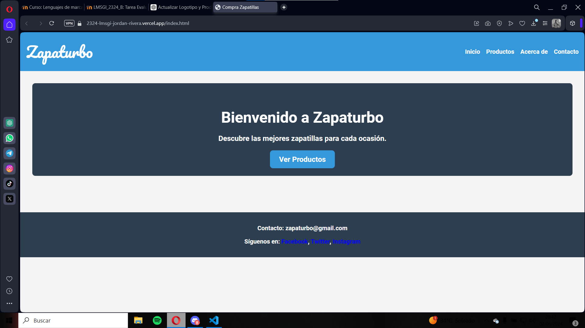
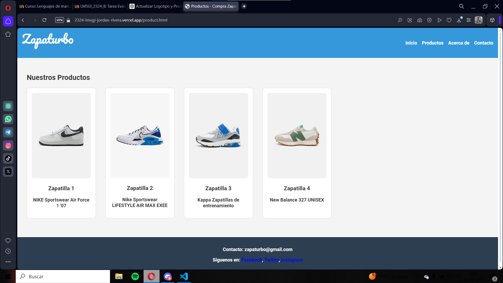
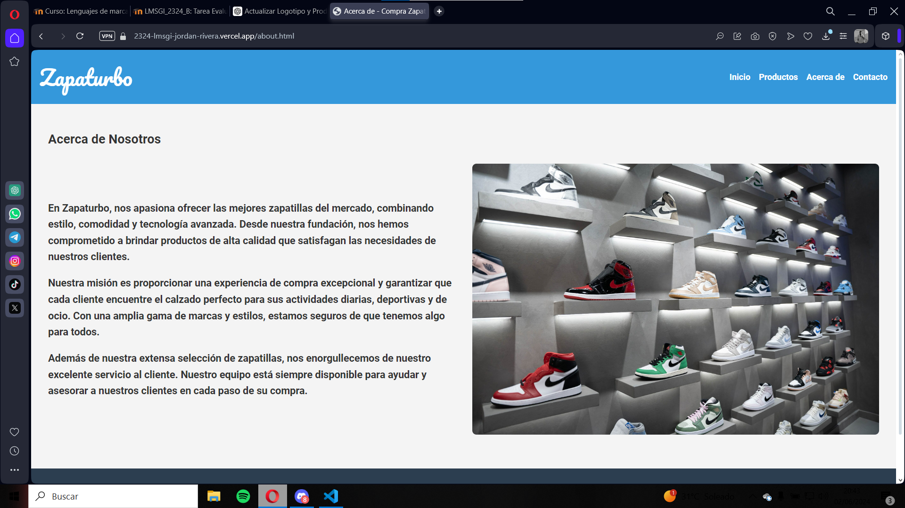
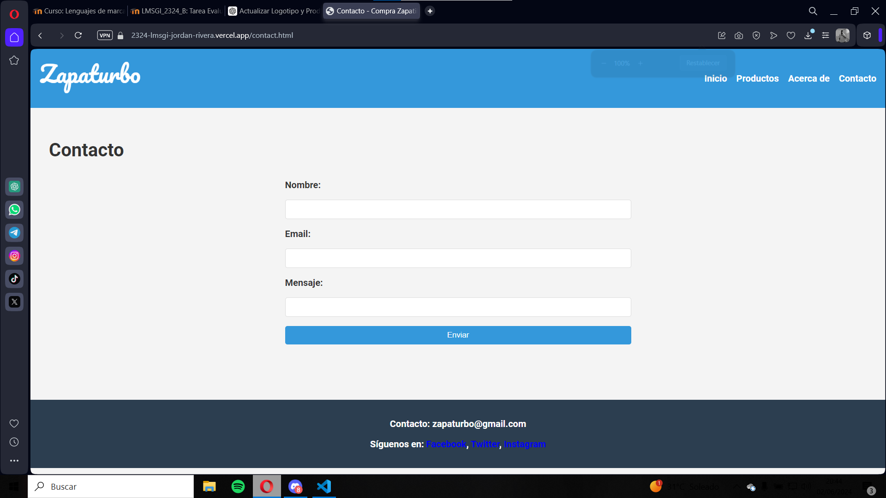
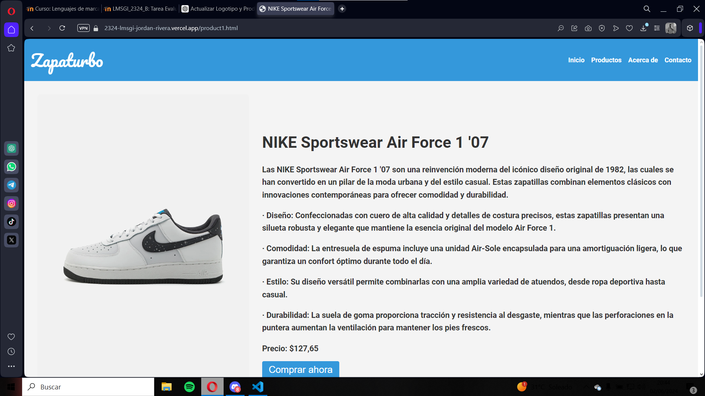
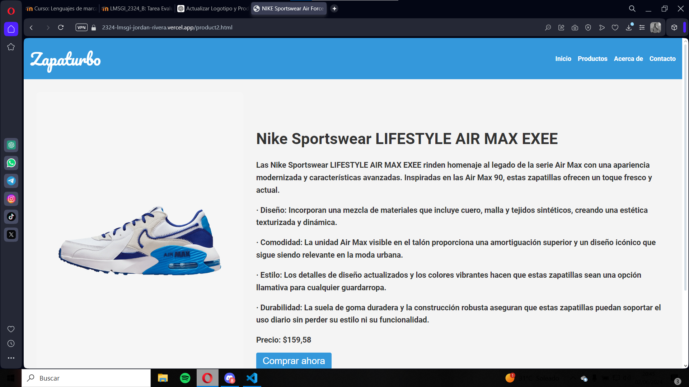
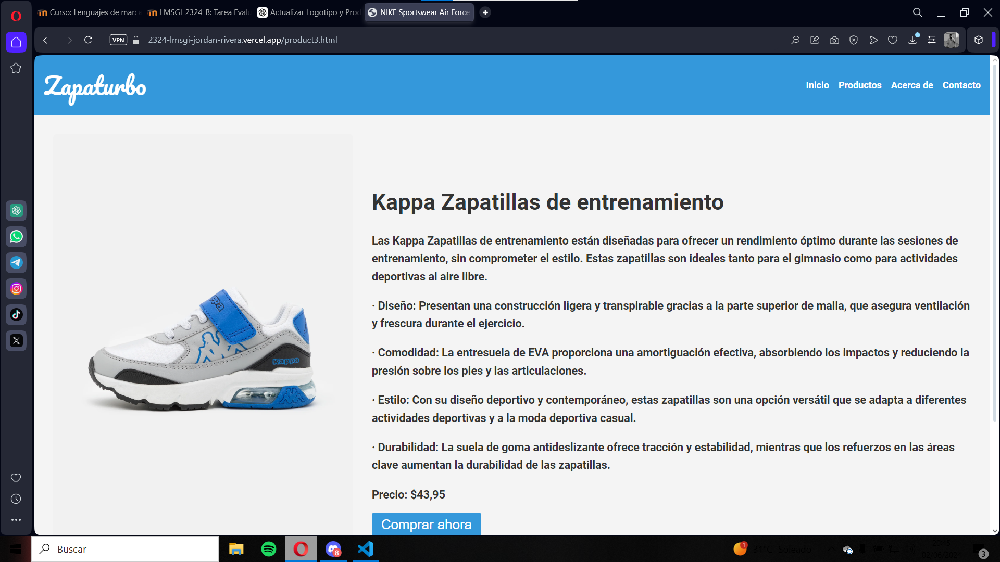
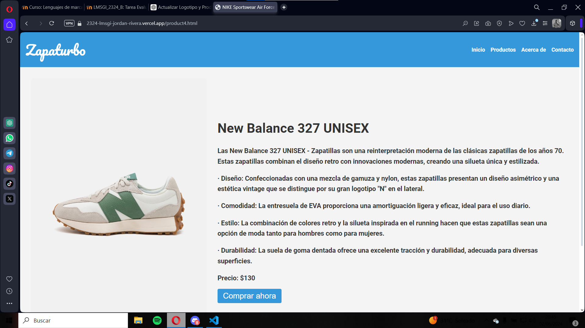

# Zapaturbo - Tienda de Zapatillas

## Descripción del proyecto

He creado una pagina web de zapatillas en la que poder comprar distintos tipos de zapatillas con un diseño bonito y limpio con el nombre de Zapaturbo.

## Tecnologías utilizadas

- HTML5
- CSS
- JavaScript

## Autor/a

Zapaturbo fue desarrollado por Jordán Rivera Fernández-Pacheco.

## Colores y tipografías

### Colores utilizados

- **Color Primario:** #3498db
- **Color Secundario:** #2c3e50
- **Color de Fondo:** #f4f4f4

### Tipografías utilizadas

- **Fuente Principal:** Roboto
- **Fuente para el Logo:** Pacifico

## Despliegue

### Web utilizada para desplegar la página/sitio web

- GitHub Pages

### URL de acceso

[Enlace a Zapaturbo](https://2324-lmsgi-jordan-rivera.vercel.app/index.html)

## Fuentes/Recursos utilizados

- [Google Fonts](https://fonts.google.com/): Para las tipografías Roboto y Pacifico.

## Capturas de pantalla

